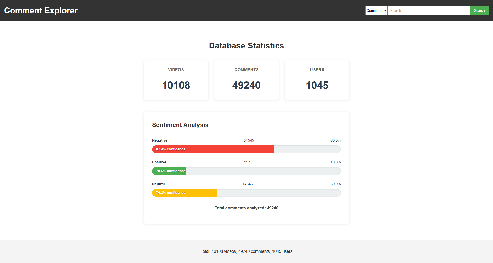

# HU-Sent - Magyar nyelvű Szentimentanalízis Projekt

# Projekt Áttekintése

A projekt célja egy magyar nyelvű szentimentanalízis modell fejlesztése
Pythonban, amely a HuSST adatkészletet használja. A modellel szembeni
elvárás, hogy képes legyen a szövegeket negatív, semleges és pozitív
kategóriákba sorolni.

# Módszertan

A cél megvalósításához a huBERT *(Hungarian Universal Bidirectional
Encoder Representations from Transformers)* betanított neurális hálót
fogom felhasználni alapmodellként. Az előre betanított neurális háló
nagyon jó kiindulási alapként szolgál, mivel magyar nyelvű adatokon
tanították, tehát általános magyar nyelvtudással rendelkezik. Képes a
szövegek értelmezésére és feldolgozására, viszont általánosságban
elmondható, hogy ezeket az alapmodelleket további tanítással kell
kiegészíteni ha specifikusan egy bizonyos célra szeretnénk használni az
alap tudását.

Jelen feladatban a HuSST adathalmazzal fogok további tanítást végezni a
modellen. A HuSST, mint korábban említésre került, magyar nyelvű
kijelentéseket tartalmaz és az azokhoz tartozó címkéket. A címke lehet
negatív, semleges vagy pozitív. Ezek alapján kerül besorolásra az adott
szöveg.

# Dataset

A bevezetőben ismertetett két forrást fogom használni a projekt
megvalósításához.

- huBERT base model (Hungarian Universal Bidirectional Encoder
  Representations from Transformers)

- HuSST dataset (Hungarian Stanford Sentiment Treebank)

## huBERT bemutatása

A huBERT egy magyar nyelvű, transzformátor alapú nyelvi modell, amelyet
a SZTAKI fejlesztett ki. A modell a BERT architektúrát követi, és
kifejezetten a magyar nyelv sajátosságainak kezelésére optimalizálták. A
tanítást az úgynevezett *Common Crawl* adatbázis magyar nyelvű részén
végezték szűrések és deduplikációk után, valamint a magyar Wikipédián
alapulva. A modell 111 millió paraméterrel rendelkezik.

## A huBERT alkalmazási lehetőségei

A huBERT modellt különféle magyar nyelvű NLP *(Natural Language
Processing)* feladatokhoz használhatjuk:

- Szövegosztályozás

- Névfelismerés (NER *(Named Entity Recognition)*)

- Szövegrészletezés (Chunking)

- Kérdésmegválaszolás

- Szöveggenerálás

# Implementáció, technológiák

A projekt megvalósítása során Python nyelven dolgozom a gépi tanulás és
a webes felület implementációjához. A modell fejlesztéséhez a PyTorch
keretrendszert, az adatkezeléshez és előfeldolgozáshoz a pandas és numpy
könyvtárakat, míg a tokenizáláshoz a Hugging Face transformers
könyvtárat használom. A megoldás konténerizálását Docker segítségével
oldom meg. A webes felület Flask webszerverrel készül, míg az adatok
tárolása PostgreSQL adatbázisban történik.

A modell és a ráépülő webes rendszer Pythonban készül a következő
könyvtárak felhasználásával:

## Alapvető Python könyvtárak

- `os`: Operációs rendszer szintű műveletek (fájlkezelés, környezeti
  változók)

- `json`: JSON adatok szerializálása és deszerializálása

- `re`: Reguláris kifejezések a szövegfeldolgozáshoz (regex)

- `time`: Időzítési műveletek és késleltetések

- `logging`: Alkalmazás naplózásának konfigurálása

- `zlib`: Adattömörítés és kicsomagolás

## Adatgyűjtés és Feldolgozás

- `requests`: HTTP kérések küldése és fogadása

- `BeautifulSoup`: HTML és XML dokumentumok elemzése

- `concurrent.futures`: Párhuzamos feldolgozás megvalósítása

- `urllib.parse`: URL címek kezelése

## Adatbázis Kapcsolatok

- `psycopg2`: PostgreSQL adatbázis-kezelőhöz való csatlakozás

- `SQLAlchemy`: ORM *(Object-Relational Mapping)* rendszer

- `datetime`: Dátum és időkezelés

## Webes Felület

- `Flask`: Mikrokeretrendszer webalkalmazás fejlesztéséhez

- `flask_login`: Felhasználói munkamenetek kezelése

- `werkzeug.security`: Jelszavak biztonságos tárolása és ellenőrzése

## Machine Learning és NLP

### PyTorch Könyvtárak

- `torch`: Tenzorműveletek és GPU támogatás

- `torch.nn`: Neurális hálók építéséhez szükséges modulok

- `torch.optim`: Optimalizálási algoritmusok (Adam, SGD)

- `torch.utils.data`: Adatbetöltés és előfeldolgozás

### NLP-specifikus Könyvtárak

- `transformers`: Előtanított nyelvi modellek kezelése

- `datasets`: Nagy nyelvi adathalmazok betöltése és kezelése

- `sklearn.metrics`: Osztályozási metrikák számítása

## Adatelemzés

- `jupyter`: Interaktív notebook környezet

- `jupyterlab`: Fejlettebb notebook felület

- `pandas`: Adatok táblázatos kezelése és elemzése

- `numpy`: Numerikus számítások és tömbműveletek

- `tqdm`: Folyamatjelző sáv iterációkhoz

## Konténerizáció

- `Docker`: Alkalmazás konténerbe csomagolása

- `Docker Compose`: Többkonténeres alkalmazások kezelése

## Függőségek

A projekt függőségeit a `requirements.txt` fájl tartalmazza.

# Alapvető szentimentanalízis modell elkészítése

A szentimentanalízis modell elkészítése több fő lépésből áll, ezek
bemutatása fog következni.

## 1. lépés: Az előre tanított BERT modell betöltése és a tanítás felparaméterezése

Első lépésként a kiválasztott nyelvhez illeszkedő előre tanított
neurális háló betöltésére van szükség. Jelen esetben a magyar
nyelvfeldolgozáshoz a `SZTAKI-HLT/hubert-base-cc` modellre esett a
választás. A konkrét megvalósítás szemléltetése érdekében beillesztem az
alábbi kódrészletet, ahol a felparaméterezés látható.

``` python
# Configuration - Using a publicly available Hungarian model
MODEL_NAME = "SZTAKI-HLT/hubert-base-cc"  # Public Hungarian BERT model
BATCH_SIZE = 16
MAX_LENGTH = 128
EPOCHS = 3
LEARNING_RATE = 2e-5
NUM_CLASSES = 3  # negative, neutral, positive
LABEL_MAP = {"negative": 0, "neutral": 1, "positive": 2} # Create label mapping
DEVICE = torch.device("cuda" if torch.cuda.is_available() else "cpu")
```

### Batch size

A kódrészletben a *Batch size* paraméter határozza meg, hogy egy
*Epoch-ban* hány minta legyen felhasználva a tanításhoz. A jelenlegi
16-os *batch size* azt jelenti, hogy ekkora csomagokban fog zajlani a
tanítás. Ez az érték kiegyensúlyozott a memóriahasználat és a tanítási
sebesség között.

### Max length

A *Max length* paraméter 128-as értéke azt állítja be, hogy legfeljebb
128 tokent tartalmazhasson egy minta. Pontosabban kifejezve, egy adott
bemenet hossza legfeljebb 128 tokenből állhat, ahol egy token például
egy szónak, szórészletnek, vagy írásjelnek feleltethető meg. A tokenek
konkrét hossza és a tokenizáció menete a eltérő lehet különböző nyelvek
között. Jelenleg a rövidebb szövegeket *padding* egészíti ki, a
hosszabbak csonkolásra kerülnek.

### Num classes és Label map

A *Num classes* és a *Label map* a tanítás során használni kívánt
kategóriákat határozza meg. Esetünkben három kategória létezik: a
negatív, semleges, és pozitív. A szöveges címkéket numerikus értékekre
képezi le, ami szükséges a neurális háló számára.

### Epochs

Az *Epochs* a tanítási iterációk számát határozza meg. Egy epoch azt
jelenti, hogy a teljes tanító adathalmazon egyszer végighaladt a modell.
Túl sok epoch túltanításhoz *(overfitting)* vezethet, míg kevesebb epoch
alultanítást *(underfitting)* eredményez. A jelenleg megadott érték
elegendő lehet egy megfelelő tanításhoz, erőforrások hiányában nem
növelem, mert azzal jelentősen növekedne a tanításhoz szükséges idő is.

### Learning rate

A *Learning rate* a tanulási ráta, ami meghatározza, hogy mennyit
változzon a modell súlya egy lépésben. Túl magas érték instabil
tanításhoz vezet, míg túl alacsony érték lassú konvergálást eredményez.
Jelenleg egy általánosan elfogadott érték került beállításra.

## 2. lépés: Adatok betöltése, előfeldolgozása, tokenizáció

Az előző fejezetben ismertetett paraméterek beállítása után elkezdhetjük
az adatok betöltését. Egyfelől az előre betanított `huBERT` neurális
hálót, másfelől a tanításhoz szükséges `HuSST` címkézett adatokat.

1.  Adathalmaz betöltése a Hugging Face `datasets` könyvtárával

2.  Szövegek tokenizálása a huBERT tokenizálóval

3.  PyTorch DataLoader-ek létrehozása a tanításhoz

A `HuSST` tanító, validációs és teszt adathalmazból áll a korábban
ismertetett felépítéssel: egy magyar kijelentéshez vagy negatív, vagy
semleges, vagy pozitív címke tartozik. Szemléltetésképp egy részlet a
tanítási adathalmazból:

``` json
[
    {
        "text": "Azonban hiányzik belőle az a nagyság és hősiesség, ami Stevensont és a korábbi Disney-meséket jellemzi.",
        "label": "negative"
    },
    {
        "text": "Informatív, ha sok beszédes részt tartalmaz egy dokumentumfilm.",
        "label": "neutral"
    },
    {
        "text": "Ha szeretsz időnként moziba menni, érdemes a Wasabi-val kezdeni.",
        "label": "positive"
    }
]
```

### Tokenizáció

A `HuSST` tokenizációját a `HuBERT` előre tanított tokenizálója végzi
el. Ennek segítségével helyesen lesznek tagolva a szavak a tanításhoz
használt szöveg betöltésekor.

``` python
# Initialize tokenizer
tokenizer = AutoTokenizer.from_pretrained(MODEL_NAME)

# Create datasets
train_dataset = HungarianSentimentDataset(
    train_texts, train_labels, tokenizer, MAX_LENGTH
)
# Create dataloaders
train_loader = DataLoader(
    train_dataset, batch_size=BATCH_SIZE, shuffle=True
)
```

## 3. lépés: Tanítás, elkészült modell mentése

A folyamat végső lépéseként elkezdhető az új modell betanítása a
korábban bemutatottak segítségével.

A *train epoch* függvény felelős a modell egy epoch-on keresztüli
tanításáért. A függvény először a modellt tanítási módba állítja, majd
inicializálja a veszteség és az előrejelzések nyilvántartását. A
tanítási ciklus a megadott adatokon halad végig, ahol minden kötegelt
adatra három fő lépést hajt végre: az adatok mozgatása a megfelelő
eszközre *(CPU/GPU, jelenleg csak CPU áll rendelkezésre a tanításhoz)*,
a forward és backward propagáció végrehajtása, valamint a paraméterek
frissítése az optimizer segítségével. A veszteségfüggvény
*CrossEntropyLoss* értékelésével és a gradiensek visszaszámításával a
modell súlyait finomhangolja.

``` python
# 3. Training functions
def train_epoch(model, data_loader, optimizer, device):
    model.train()
    total_loss = 0
    correct_predictions = 0

    for batch in tqdm(data_loader, desc="Training"):
        input_ids = batch['input_ids'].to(device)
        attention_mask = batch['attention_mask'].to(device)
        labels = batch['label'].to(device)

        optimizer.zero_grad()
        outputs = model(input_ids, attention_mask)
        loss = nn.CrossEntropyLoss()(outputs, labels)
        loss.backward()
        optimizer.step()

        total_loss += loss.item()
        _, preds = torch.max(outputs, dim=1)
        correct_predictions += torch.sum(preds == labels)

    accuracy = correct_predictions.double() / len(data_loader.dataset)
    avg_loss = total_loss / len(data_loader)

    return avg_loss, accuracy
```

A folyamat utolsó szakaszában a modell tényleges betanítása történik meg
a korábban definiált komponensek felhasználásával. A tanítási folyamat
során a modell többször feldolgozza a teljes tanító adathalmazt,
miközben a veszteségfüggvény minimalizálására törekszik. Minden futás
után értékelni lehet a modell teljesítményét a validációs halmazon, ami
lehetővé teszi a túlilleszkedés *(overfitting)* felismerését. Az
elkészült modellt a diszlre kerül mentésre, hogy predikciókat lehessen
vele végezni a későbbiekben. A mentés során nem csak a modell súlyait,
hanem a tokenizálót és a konfigurációs paramétereket is érdemes
elmenteni.

## A modell tanítása közben keletkezett kimenet

```
C:\Temp\py\hu-sent\venv\Scripts\python.exe C:\Temp\py\hu-sent\learn.py

Epoch 1/3
------------------------------
Training: 100%|==========| 583/583 [2:23:42<00:00, 14.79s/it]
Train Loss: 0.6952, Accuracy: 0.6944
Evaluation: 100%|==========| 73/73 [05:27<00:00,  4.49s/it]
Val Loss: 0.5807, Accuracy: 0.7399
Saved new best model

Classification Report:
Training:   0%|          | 0/583 [00:00<?, ?it/s]              precision    recall  f1-score   support

    negative       0.75      0.91      0.82       697
     neutral       0.76      0.48      0.59       435
    positive       0.40      0.55      0.46        33

    accuracy                           0.74      1165
   macro avg       0.64      0.65      0.62      1165
weighted avg       0.75      0.74      0.73      1165


Epoch 2/3
------------------------------
Training: 100%|==========| 583/583 [2:14:58<00:00, 13.89s/it]
Train Loss: 0.4737, Accuracy: 0.8001
Evaluation: 100%|%|==========| 73/73 [05:00<00:00,  4.12s/it]
Val Loss: 0.6953, Accuracy: 0.6884

Classification Report:
              precision    recall  f1-score   support

    negative       0.79      0.80      0.80       697
     neutral       0.68      0.50      0.58       435
    positive       0.18      0.82      0.30        33

    accuracy                           0.69      1165
   macro avg       0.55      0.71      0.56      1165
weighted avg       0.74      0.69      0.70      1165


Epoch 3/3
------------------------------
Training: 100%|==========| 583/583 [2:11:09<00:00, 13.50s/it]
Train Loss: 0.3142, Accuracy: 0.8765
Evaluation: 100%|==========| 73/73 [04:58<00:00,  4.08s/it]
Val Loss: 0.7588, Accuracy: 0.7425
Saved new best model

Classification Report:
              precision    recall  f1-score   support

    negative       0.80      0.86      0.83       697
     neutral       0.74      0.56      0.64       435
    positive       0.27      0.70      0.39        33

    accuracy                           0.74      1165
   macro avg       0.60      0.71      0.62      1165
weighted avg       0.76      0.74      0.74      1165


Training complete. Best validation accuracy: 0.7425

Process finished with exit code 0
```

# Az elkészült modell felhasználása

A betanított, elkészült modellt egy egyszerű *Python* fájlban is tudjuk
használni, vagy *Jupyter Notebookban*. Ezek a módszerek alapvetően jók
tesztelésre vagy további fejlesztésekhez, de nem túl felhasználóbarátok.

A könnyű használhatóság érdekében fontosnak tartottam valamilyen
felhasználói grafikus interfész implementálását, ehhez a legegyszerűbben
elkészíthető, multiplatform megoldást választottam: a webes felületet. A
felület segítségével felhasználói oldalon bármilyen eszközről
használható a rendszer, amelyen van böngésző. A webszervert és a modellt
*Docker* konténerben lehet futtatni *docker compose* segítségével.

## Futtatás Python fájlból

Első körben a kipróbálás és tesztelés legegyszerűbb módja, a
predikcióhoz készült *Python* fájl futtatása. Ennek egy példája látható
a következő sorokban.

        (venv) C:\Temp\py\hu-sent>python prediction.py
        Text: Ez a film fantasztikus volt!
        Sentiment: positive
        
        Text: Nem tetszett a könyv.
        Sentiment: negative
        
        Text: Átlagos élmény volt, semmi különös.
        Sentiment: negative
        
        Text: Süt a nap.
        Sentiment: neutral
        
        Text: Esik az eső.
        Sentiment: neutral
        
        Text: Szép időnk van ma.
        Sentiment: positive

## Futtatás webes felülettel

A webes verzió futtatásához *Docker compose* segítségével el kell
indítani az alábbi szolgáltatásokat:

- **Adatbázis szerver** (PostgreSQL): Felhasználói adatok és előzmények
  tárolása

- **API szerver** (Python Flask): A szentiment elemzés végrehajtása REST
  API-n keresztül

- **Webszerver** (Flask): Felhasználói felület megjelenítése

Futtatáskor a *Docker* az alábbi kimenetet adja, amiből meggyőződhetünk
róla, hogy minden szolgáltatás megfelelően el tudott indulni és
elérhető. Ha mindez megtörtént, böngészővel tudunk csatlakozni a
kiszolgáló IP címén, az 5000-es porton futó webszerverhez.

```
(venv) C:\Temp\py\hu-sent\sentimentapp>docker compose up
time="2025-05-03T12:16:32+02:00" level=warning msg="C:\\Temp\\py\\hu-sent\\sentimentapp\\docker-compose.yml: the attribute `version` is obsolete, it will be ignored, please remove it to avoid potential confusion"
[+] Running 3/3
  Container sentimentapp-db-1             Created                                                                                          0.0s
  Container sentimentapp-sentiment-api-1  Created                                                                                          0.0s
  Container sentimentapp-web-client-1     Created                                                                                          0.0s
Attaching to db-1, sentiment-api-1, web-client-1
db-1             |
db-1             | PostgreSQL Database directory appears to contain a database; Skipping initialization
db-1             |
db-1             | 2025-05-03 10:16:34.041 UTC [1] LOG:  starting PostgreSQL 13.20 (Debian 13.20-1.pgdg120+1) on x86_64-pc-linux-gnu, compiled by gcc (Debian 12.2.0-14) 12.2.0, 64-bit
db-1             | 2025-05-03 10:16:34.041 UTC [1] LOG:  listening on IPv4 address "0.0.0.0", port 5432
db-1             | 2025-05-03 10:16:34.041 UTC [1] LOG:  listening on IPv6 address "::", port 5432
db-1             | 2025-05-03 10:16:34.043 UTC [1] LOG:  listening on Unix socket "/var/run/postgresql/.s.PGSQL.5432"
db-1             | 2025-05-03 10:16:34.049 UTC [27] LOG:  database system was interrupted; last known up at 2025-05-02 18:35:34 UTC
db-1             | 2025-05-03 10:16:34.196 UTC [27] LOG:  database system was not properly shut down; automatic recovery in progress
db-1             | 2025-05-03 10:16:34.198 UTC [27] LOG:  redo starts at 0/160C470
db-1             | 2025-05-03 10:16:34.198 UTC [27] LOG:  invalid record length at 0/160C558: wanted 24, got 0
db-1             | 2025-05-03 10:16:34.198 UTC [27] LOG:  redo done at 0/160C520
db-1             | 2025-05-03 10:16:34.212 UTC [1] LOG:  database system is ready to accept connections
sentiment-api-1  |  * Serving Flask app 'app'
sentiment-api-1  |  * Debug mode: off
sentiment-api-1  | WARNING: This is a development server. Do not use it in a production deployment. Use a production WSGI server instead.
sentiment-api-1  |  * Running on all addresses (0.0.0.0)
sentiment-api-1  |  * Running on http://127.0.0.1:5000
sentiment-api-1  |  * Running on http://172.18.0.3:5000
sentiment-api-1  | Press CTRL+C to quit
sentiment-api-1  | 127.0.0.1 - - [03/May/2025 10:17:09] "HEAD /health HTTP/1.1" 200 -
web-client-1     |  * Serving Flask app 'app'
web-client-1     |  * Debug mode: on
web-client-1     | WARNING: This is a development server. Do not use it in a production deployment. Use a production WSGI server instead.
web-client-1     |  * Running on all addresses (0.0.0.0)
web-client-1     |  * Running on http://127.0.0.1:5000
web-client-1     |  * Running on http://172.18.0.4:5000
web-client-1     | Press CTRL+C to quit
web-client-1     |  * Restarting with stat
web-client-1     |  * Debugger is active!
web-client-1     |  * Debugger PIN: 118-356-955
sentiment-api-1  | 127.0.0.1 - - [03/May/2025 10:17:39] "HEAD /health HTTP/1.1" 200 -
```

## Webes szolgáltatások

A rendszer rendelkezik felhasználókezeléssel, regisztrációs és
bejelentkezési felülettel, valamint a felhasználók chatelőzményeinek
tárolásával.

Néhány kép működés közben:

<figure id="fig:01_login">

<figcaption>Bejelentkezési felület</figcaption>
</figure>

<figure id="fig:02_register">

<figcaption>Regisztrációs felület</figcaption>
</figure>

<figure id="fig:03_chat">

<figcaption>Üres chatfelület</figcaption>
</figure>

<figure id="fig:05_history">

<figcaption>Előzmények törlése</figcaption>
</figure>

<figure id="fig:04_chat">

<figcaption>Chatfelület néhány példával</figcaption>
</figure>

## Adatbázis modell

A rendszer két fő táblát használ:

| **Mező**        | **Típus**    | **Leírás**                 |
|:----------------|:-------------|:---------------------------|
| `id`            | Integer      | Elsődleges kulcs           |
| `username`      | String(100)  | Egyedi felhasználónév      |
| `password_hash` | String(200)  | Titkosított jelszó         |
| `created_at`    | DateTime     | Regisztráció időpontja     |
| `chats`         | Relationship | A felhasználó chatüzenetei |

Felhasználói tábla (`User`)

<span id="tab:user" label="tab:user"></span>

| **Mező**     | **Típus**    | **Leírás**                    |
|:-------------|:-------------|:------------------------------|
| `id`         | Integer      | Elsődleges kulcs              |
| `user_id`    | Integer      | Külső kulcs a `User` táblához |
| `message`    | String(1000) | Felhasználó üzenete           |
| `sentiment`  | String(20)   | Érzelmi értékelés eredménye   |
| `confidence` | Float        | A modell bizonyossága         |
| `created_at` | DateTime     | Üzenet időpontja              |

Chat tábla (`Chat`)

<span id="tab:chat" label="tab:chat"></span>

## Adatbázis kapcsolatok

- Egy felhasználó (`User`) több chatüzenettel (`Chat`) rendelkezhet

- Minden chatüzenet pontosan egy felhasználóhoz tartozik

## Docker és Docker Compose

Ahogy az korábban említve lett, a webes szentimentanalízis alkalmazás
*Docker* konténerizációval készült, a könnyű telepítés, hordozhatóság és
reprodukálhatóság érdekében. A konténerizált környezet kiváló
lehetőségeket nyújt a fejlesztés, tesztelés és üzemeltetés területén. A
függőségek konténerekbe csomagolásával megszűnnek a kompatibilitási
problémák és az alkalmazás bármely Docker-t támogató platformon
futtatható. A szolgáltatások szükség szerint akár skálázhatók is.

A szolgáltatások a Docker által biztosított belső hálózaton
kommunikálnak egymással, a *depends_on* direktívák pedig biztosítják a
megfelelő indítási sorrendet. Jelenleg:

- Elsőként az adatbázis szerver

- Másodikként a szentiment API

- Végül a webszerver indul

A kötetek (*volumes*) használata garantálja az adatmegőrzést a
konténerek újraindítása esetén is. Perzisztenciára jelenleg csak az
adatbázis esetében van szükség.

A *Docker Compose* segítségével a három szükséges konténer kezelése
egybe van szervezve, és a beállításaik tárolva vannak. Amennyiben a
*Docker* fájlok és a *Docker Compose* fájl jól van elkészítve, a program
indításához mindössze a `docker compose up –build` parancsot kell
kiadni, és automatikusan lefutnak a folyamatok.

## Docker fájlok

```
version: '3.8'

    services:
      db:
        image: postgres:13
        environment:
          POSTGRES_USER: sentiment_user
          POSTGRES_PASSWORD: sentiment_pass
          POSTGRES_DB: sentiment_db
        volumes:
          - postgres_data:/var/lib/postgresql/data
        ports:
          - "5432:5432"
        healthcheck:
          test: ["CMD-SHELL", "pg_isready -U sentiment_user -d sentiment_db"]
          interval: 5s
          timeout: 5s
          retries: 5
    
      sentiment-api:
        build:
          context: .
          dockerfile: model/Dockerfile
        ports:
          - "5001:5000"
        environment:
          - MODEL_NAME=SZTAKI-HLT/hubert-base-cc
          - MAX_LENGTH=128
          - DATABASE_URL=postgresql://sentiment_user:sentiment_pass@db:5432/sentiment_db
        depends_on:
          db:
            condition: service_healthy
        healthcheck:
          test: ["CMD-SHELL", "wget -q --spider http://127.0.0.1:5000/health || exit 1"]
          interval: 30s
          timeout: 10s
          retries: 3
        restart: unless-stopped
    
      web-client:
        build:
          context: .
          dockerfile: client/Dockerfile
        ports:
          - "5000:5000"
        depends_on:
          sentiment-api:
            condition: service_healthy
          db:
            condition: service_healthy
        environment:
          - API_URL=http://sentiment-api:5000/predict
          - DATABASE_URL=postgresql://sentiment_user:sentiment_pass@db:5432/sentiment_db
          - SECRET_KEY=your-secret-key-here
        restart: unless-stopped
    
    volumes:
      postgres_data:    
```

```
FROM python:3.9-slim
    
    WORKDIR /app
    
    # Install necessary system dependencies
    RUN apt-get update && apt-get install -y gcc python3-dev curl wget && rm -rf /var/lib/apt/lists/*
    
    # Copy the requirements.txt specific to the model service
    COPY model/requirements.txt /app/requirements.txt
    
    # Install dependencies
    RUN pip install --no-cache-dir -r /app/requirements.txt
    
    # Copy the rest of the model code to the container's /app directory
    COPY model /app
    
    # Set the command to run the application (ensure the app.py is at /app/app.py)
    CMD ["python", "/app/app.py"]
```

```
FROM python:3.9-slim
    
    WORKDIR /app
    
    COPY client/requirements.txt .
    RUN pip install --no-cache-dir -r requirements.txt
    
    COPY client/ /app
    
    RUN mkdir -p instance
    
    CMD ["python", "app.py"]
```

# Kommenteken végzett szentimentanalízis

A projekt egyik ötlete egy szentimentanalízisre szolgáló webes
chatfelület kialakítása, míg a másik megközelítés weboldalakról származó
szövegek és kommentek automatikus gyűjtése valamint azok elemzése, majd
egy webes felületen az eredmények megjelenítése.

## Web scraping

Az ötlet megvalósításához szükség van egy adatforrásra, ahonnan nagy
mennyiségben hozzászólásokat lehet gyűjteni. Erre a célra egy fórum
oldal felhasználását tűztem ki, ahol körülbelül 50.000 komment érhető
el. A hozzászólások letöltéséhez egy erre a *web scrapingre* szánt
Python scriptet készítettem, ami *HTTP* kérésekkel tölti le a
weboldalról az adatokat. Az oldal eredeti formája *AJAX* kéréseket
használ a kommentek betöltéséhez, így ezeket az *API* hívásokat
Pythonban elkészítve, majd a válaszként érkezett *HTML* kódot
megtisztítva *JSON* fájlokat tudtam előállítani. A *JSON* az alábbi
mezőkkel rendelkezik:

```
{
  "id_placeholder": {
    "metadata": {
      "id": 0,
      "title": "Title Placeholder",
      "description": "Description Placeholder",
      "url": "https://example.com",
      "tags": [
        "tag1",
        "tag2"
      ],
      "download_link": null
    },
    "comments": [
      {
        "id": "comment_id",
        "user": {
          "username": "Username Placeholder",
          "profile_url": "https://example.com/user",
          "avatar": "https://example.com/avatar.jpg",
          "avatar_local": "path/to/avatar.jpg"
        },
        "timestamp": "Timestamp Placeholder",
        "text": "Comment text placeholder",
        "upvotes": 0,
        "replies": [],
        "has_more_replies": false,
        "reply_count": 0
      }
    ]
  }
}
```

## Docker Compose beállításai

A teljes rendszer indításához több konténerre is szükség van. Elsőként a
*PostgreSQL* adatbázist kell elindítani, majd a szkriptet ami importálja
a *JSON* fájlokban rögzített adatokat az adatbázisba. Utána a
szentimentanalízis *API-t*, következőként a szkriptet ami elküldi az
*API-nak* az adatbázisban rögzített kommenteket, végül a webes felületet
szolgáltató webalkalmazást ami az adatbázissal kommunikál. A
perzisztencia érdekében egy *docker volume* csatolására is szükség van.

```
services:
  # Main comment database (only service with volume)
  db:
    image: postgres:13
    environment:
      POSTGRES_USER: comment_user
      POSTGRES_PASSWORD: comment_password
      POSTGRES_DB: comments_db
    volumes:
      - postgres_data:/var/lib/postgresql/data
    ports:
      - "5432:5432"
    healthcheck:
      test: ["CMD-SHELL", "pg_isready -U comment_user -d comments_db"]
      interval: 5s
      timeout: 5s
      retries: 5

  importer:
    build:
      context: .
      dockerfile: ./importer/Dockerfile
    environment:
      DATABASE_URL: "postgresql://comment_user:comment_password@db:5432/comments_db"
    depends_on:
      db:
        condition: service_healthy
    restart: "no"

  sentiment_api:
    build:
      context: .
      dockerfile: ./model/Dockerfile
    ports:
      - "5001:5000"
    environment:
      - MODEL_NAME=SZTAKI-HLT/hubert-base-cc
      - MAX_LENGTH=128
    healthcheck:
      test: [ "CMD-SHELL", "curl -f http://localhost:5000/health || exit 1" ]
      interval: 10s
      timeout: 5s
      retries: 3
    depends_on:
      importer:
        condition: service_completed_successfully

  sentiment_processor:
    build:
      context: .
      dockerfile: ./sentiment_processor/Dockerfile
    environment:
      DATABASE_URL: "postgresql://comment_user:comment_password@db:5432/comments_db"
      SENTIMENT_API_URL: "http://sentiment_api:5000/predict"
    depends_on:
      sentiment_api:
        condition: service_healthy
    restart: unless-stopped

  webapp:
    build:
      context: ./webapp
      dockerfile: Dockerfile
    environment:
      DATABASE_URL: "postgresql://comment_user:comment_password@db:5432/comments_db"
    ports:
      - "5000:5000"
    depends_on:
      db:
        condition: service_healthy
      sentiment_processor:
        condition: service_started

volumes:
  postgres_data:
```

## Elért eredmények

A kijelölt oldalról körülbelül 10.000 *json* fájl került előállításra és
50.000 komment kiértékelésre. A fórumon lévő kommenteket
szentimentanalízis alá vetve a következő eredményeket láthatjuk:

- **Negatív kommentek száma:** 31 500 (*87% konfidencia*)

- **Semleges kommentek száma:** 14 300 (*74% konfidencia*)

- **Pozitív kommentek száma:** 3 300 (*80% konfidencia*)

<figure id="fig:06_comment_home">

<figcaption>Komment szentimentanalízis</figcaption>
</figure>

<figure id="fig:07_comment_stats">

<figcaption>Komment szentimentanalízis statisztika</figcaption>
</figure>

<figure id="fig:08_comment_user">

<figcaption>Felhasználó szentimentanalízise</figcaption>
</figure>

## Egyéb funkciók

- Keresés a kommentek és felhasználók között

- Találatok szűrése és rendezése

- Felhasználó szentiment elemzése a kommentjei alapján

# Források

A dokumentumot az alább felsorolt források segítségével készítettem el.

SZTAKI-HLT. *hubert-base-cc*. Hugging Face.  
<https://huggingface.co/SZTAKI-HLT/hubert-base-cc>

NYTK. *HuSST Dataset*. Hugging Face.  
<https://huggingface.co/datasets/NYTK/HuSST>

SZTAKI-HLT. *huBERT - Hungarian BERT Model*. BME-HLT.  
<https://hlt.bme.hu/hu/resources/hubert>

Orosz György. *Awesome Hungarian NLP Resources*. GitBook.  
<https://oroszgy.gitbook.io/awesome-hungarian-nlp-resources>

Orosz György. (2023). *Awesome Hungarian NLP*. GitHub.  
<https://github.com/oroszgy/awesome-hungarian-nlp>

Laki László J., Yang Zijian Győző. (2022). *huBERT - Hungarian BERT*.
Acta Universitatis Óbuda.  
<https://acta.uni-obuda.hu/Laki_Yang_134.pdf>

Docker Inc. *Install Docker Engine on Debian*. Docker Documentation.  
<https://docs.docker.com/engine/install/debian/>

Docker Inc. *Linux post-installation steps for Docker Engine*. Docker
Documentation.  
<https://docs.docker.com/engine/install/linux-postinstall/>

Wikipedia contributors. *BERT (language model)*. Wikipedia.  
<https://en.wikipedia.org/wiki/BERT_(language_model)>

Shaikh, Rayyan. *A Comprehensive Guide to Understanding BERT: From
Beginners to Advanced*. Medium.  
<https://medium.com/@shaikhrayyan123/a-comprehensive-guide-to-understanding-bert-from-beginners-to-advanced-2379699e2b51>

NYTK. *sentiment-hts5-hubert-hungarian*. Hugging Face.  
<https://huggingface.co/NYTK/sentiment-hts5-hubert-hungarian>
